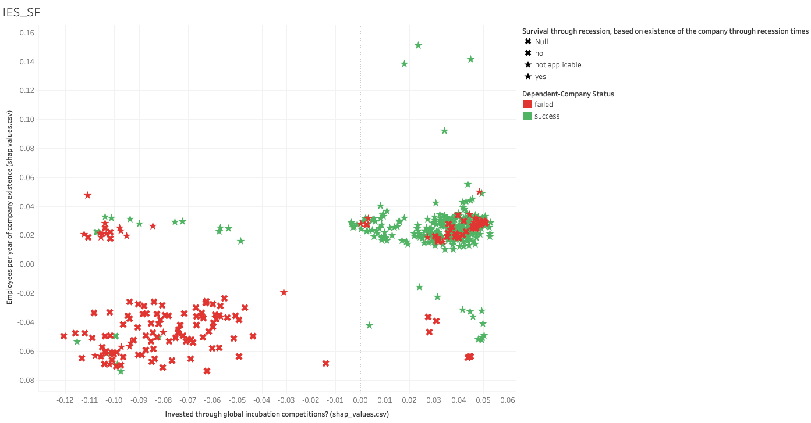

## Startup success prediction

### **Objective**
The objective is to predict whether a startup which is currently operating turns into a success or a failure. The success of a company is defined as the event that gives the company's founders a large sum of money through the process of M&A (Merger and Acquisition) or an IPO (Initial Public Offering). A company would be considered as failed if it had to be shut down.

### **Overview**

In this project, we will develop a production model for identifying the determinates of startup company success. We will focus on data preprocessing with sklearn pipelines and prediction interpretation with shap values.

We will then visualize the findings using Matplotlib, NetworkX and Tableau.

