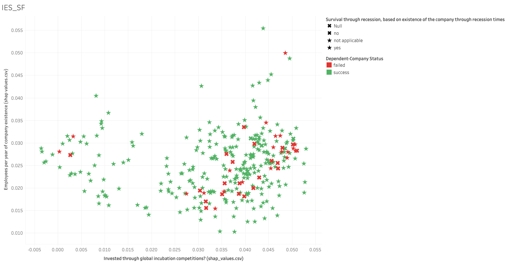

## Hello world

In this project, we will develop a production model for identifying the determinates of startup company success. We will focus on data preprocessing with sklearn pipelines and prediction interpretation with shap values.

